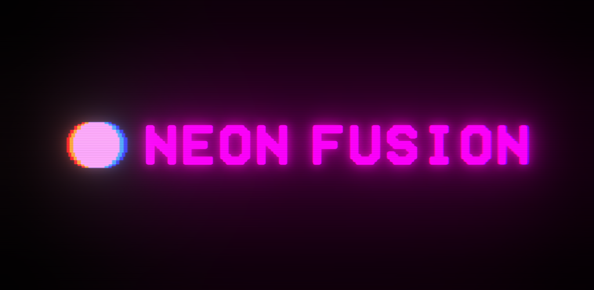

# Neon Fusion

    <a href="README.md">Türkçe</a>
    ·
    <a href="README_EN.md">English</a>

### Neon Fusion - App Store: [https://apps.apple.com/us/app/neon-fusion-merge-game/id6794359110](https://apps.apple.com/us/app/neon-fusion-merge-game/id6794359110)
### Neon Fusion - Google Play: [https://play.google.com/store/apps/details?id=com.mrtcnbykl.neonfusion](https://play.google.com/store/apps/details?id=com.mrtcnbykl.neonfusion)
***Neon Fusion**, a game I have developed using the independent developer identity **mrtcnbykl**, has been released on App Store and Google Play on September 21, 2026.*

 

*Neon Fusion*, with its art design and gameplay inspired by retro handheld game consoles, was developed using the C# programming language via the Unity Game Engine.

- The game's visual and audio art designs are based on my own creations.
- The game was developed through a cycle of thinking, designing, researching, and implementing.
- The use of generative artificial intelligence was avoided in the design and programming processes.

 

## *mrtcnbykl*
*You can access my other works via the link [mrtcnbykl](https://github.com/mertcanbaykal/mrtcnbykl)*
